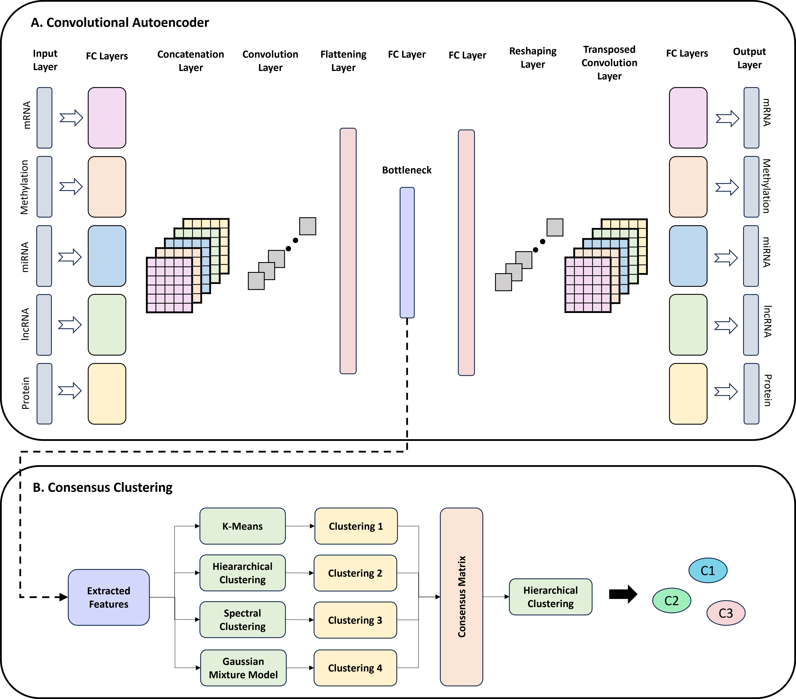

# CAECC-Subtyper

The **CAECC-Subtyper** framework combines Convolutional Autoencoder with Consensus Clustering to extract meaningful features from multi-omics data and identify cancer subtypes. This repository provides a command-line interface to perform feature extraction, clustering, or the entire pipeline in an end-to-end manner.

<div align="center">
  
</div>

## Features

- **Convolutional Autoencoder**: Extract compressed features from multi-omics datasets.
- **Consensus Clustering**: Perform robust clustering using multiple algorithms to generate consensus clusters.
- **Modes**:
  - `features`: Extract features only.
  - `full_pipeline`: Run the entire workflow (feature extraction + clustering).
  - `clustering`: Perform clustering using pre-extracted features.

---

## Requirements

- Python 3.10+
- Libraries:
  - `numpy`
  - `pandas`
  - `tensorflow`
  - `keras`
  - `scikit-learn`

Install dependencies using:
```bash
pip install -r requirements.txt
```

---

## Usage

Run the framework from the command line with the following options:

### Command-Line Arguments

| Argument           | Description                                                                |
|--------------------|----------------------------------------------------------------------------|
| `--mode`           | Operation mode: `features`, `full_pipeline`, or `clustering`.              |
| `--output`         | Path to the directory where results will be saved.                         |
| `--data_folder`    | Path to the folder containing multi-omics datasets in CSV format.          |
| `--clusters`       | Number of clusters for consensus clustering (default: `5`).                |


### Example Commands

#### 1. Extract Features
```bash
python caecc_subtyper.py --mode features --data_folder datasets/ --output results/
```
- This extracts features from the multi-omics datasets and saves them as `extracted_features.csv` in the `results/` folder.

#### 2. Run the Full Pipeline
```bash
python caecc_subtyper.py --mode full_pipeline --data_folder datasets/ --output results/ --clusters 5
```
- This runs both feature extraction and clustering, saving results as:
  - `extracted_features.csv`: Extracted features.
  - `clusters.csv`: Cluster assignments.

#### 3. Perform Clustering Only
```bash
python caecc_subtyper.py --mode clustering --data_folder datasets/ --output results/ --clusters 5
```
- This uses the pre-extracted features (`extracted_features.csv`) to perform clustering, saving cluster assignments as `clusters.csv`.

---

## Input File Format

- Input files should be in **CSV format** and stored in a single folder.
- Each file represents one omics dataset.
- Rows are samples, and columns are features.

Example folder structure:
```
datasets/
├── mrna.csv
├── methyl.csv
├── mirna.csv
├── lncrna.csv
├── protein.csv
```

---

## Output Files

- `extracted_features.csv`: Compressed feature representations for each sample.
- `clusters.csv`: Cluster assignments for each sample.

---
